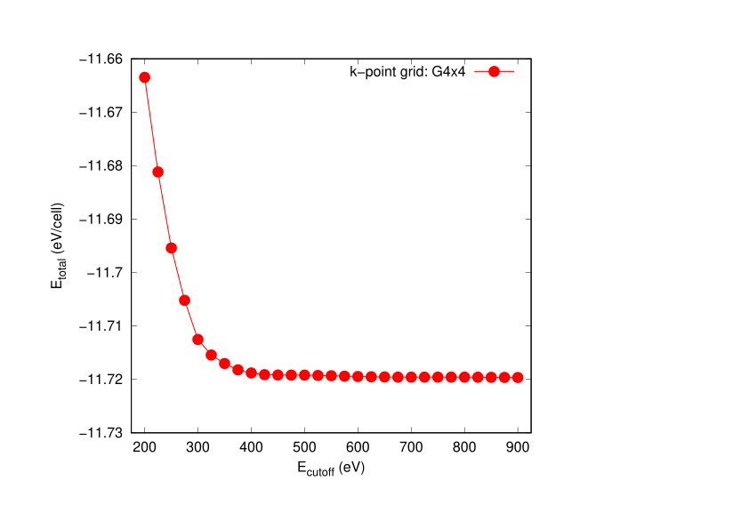
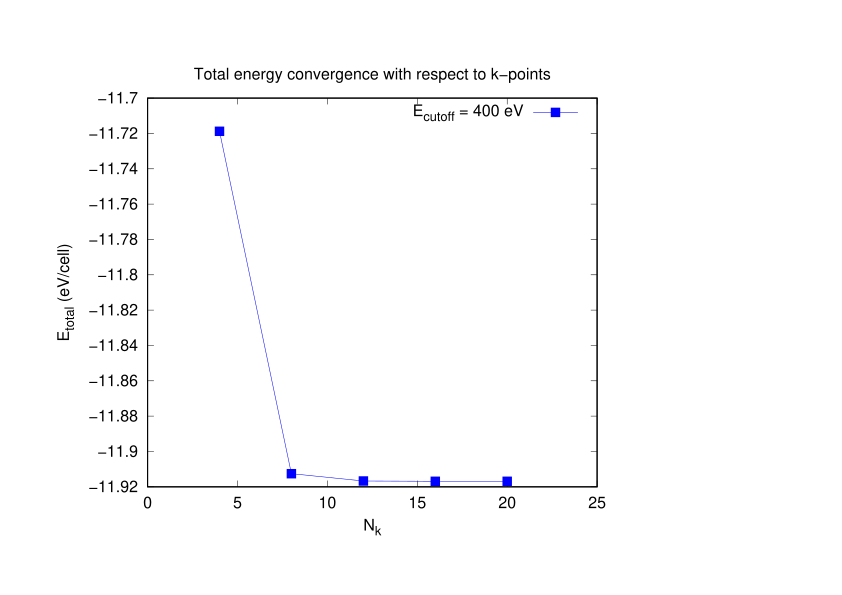
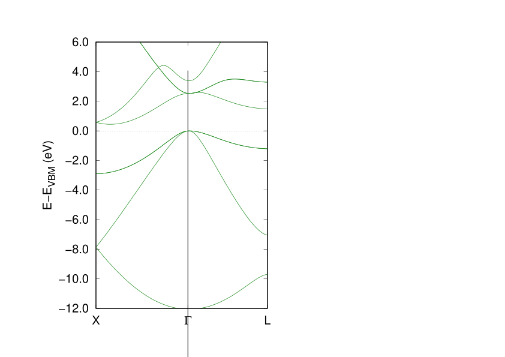

# Electronic Structure of Bulk Silicon

## Objective
The goal of this project is to investigate the electronic structure of bulk silicon using density functional theory (DFT) and to establish reliable computational parameters through systematic convergence tests.

## Why Silicon?
Silicon is the prototypical semiconductor and a benchmark material for validating DFT workflows.  
Its well-known experimental band structure and lattice constant make it an ideal system for convergence testing and methodological validation.

## Methodology
- DFT code: VASP
- Exchange–correlation functional: PBE
- Plane-wave cutoff energy (ENCUT): 200–900 eV
- k-point mesh: 4×4×4 to 20×20x20
- Crystal structure: Diamond cubic
- Convergence criteria:
  - Total energy: 1 meV/atom
  - Force: 0.01 eV/Å

## Convergence Tests

### ENCUT Convergence
We performed total energy calculations for ENCUT values ranging from 300 eV to 600 eV.  
The total energy was found to converge within 1 meV/atom at ENCUT ≥ 450 eV.

*(Figure: ENCUT vs Total Energy)*

### k-point Convergence
We tested Monkhorst–Pack k-point meshes from 4×4×4 to 12×12×12.  
Energy convergence within 1 meV/atom was achieved at 8×8×8.

## Results

### Optimized Lattice Constant
The optimized lattice constant obtained from total energy minimization is approximately 5.43 Å, which is in good agreement with the experimental value (~5.43 Å).

### Band Structure
The calculated band structure shows an indirect band gap with the valence band maximum at Γ and the conduction band minimum near the X point.  
The PBE band gap is approximately 0.6 eV, which underestimates the experimental value (~1.1 eV), as expected for semi-local functionals.

### Density of States (DOS)
The DOS indicates dominant contributions from Si p-orbitals near the valence band maximum and Si s-orbitals near the conduction band minimum.

## Discussion
- The convergence tests ensure numerical reliability of the reported electronic structure.
- The optimized lattice constant closely matches the experimental value, validating the computational setup.
- The band gap underestimation is attributed to the known limitations of the PBE functional.
- Future work includes HSE06 calculations and GW corrections for more accurate band gaps.

## Directory Structure

- calc/     : Step-by-step DFT input files (convergence tests, relaxation, band, DOS)
- scripts/  : Job submission and post-processing scripts (SLURM, Python)
- data/     : Parsed numerical outputs
- figures/  : Final plots used for analysis and presentation
- logs/     : OUTCAR tail excerpts are provided (relaxation steps)
to demonstrate successful DFT calculations and HPC execution.

## How to Reproduce

1. Prepare input files in `input/`
2. Run ENCUT convergence tests
3. Run k-point convergence tests
4. Run SCF calculation
5. Run band structure and DOS calculations
6. Post-process results
