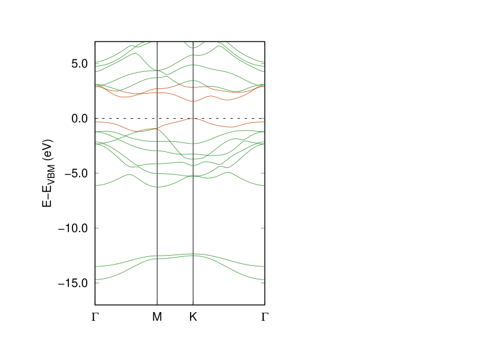
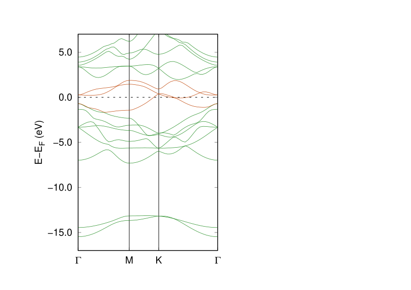
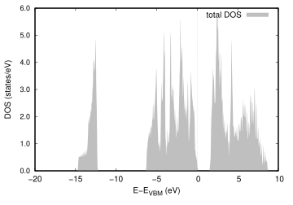
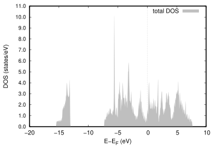

# Electronic Structure of WSe₂ Monolayers: 2H vs 1T Phases

## Overview
This project investigates the electronic structure of monolayer WSe₂
in the 2H and 1T structural phases using density functional theory (DFT).
All calculations were performed with VASP within the PBE approximation,
following a consistent workflow including convergence tests,
structural relaxation, and band structure/DOS analysis.

The primary goal is to compare the qualitative difference in electronic behavior
between the semiconducting 2H phase and the metallic 1T phase,
and to establish a reproducible DFT calculation pipeline for 2D materials.

---

## Key Results

### Band Structures

- The 2H phase exhibits a semiconducting band structure.
- The 1T phase shows metallic behavior with bands crossing the Fermi level.

### Density of States

The qualitative difference between the two phases is clearly reflected
in the density of states near the Fermi level.

---

## Computational Details

- **Code**: VASP
- **Exchange–correlation functional**: PBE (GGA)
- **Pseudopotentials**: PAW (VASP standard)
- **Plane-wave cutoff energy**: XX eV  
  (selected based on total energy convergence tests)
- **k-point mesh (relaxation / DOS)**: XX × XX × 1
- **Vacuum thickness**: > XX Å to avoid interlayer interactions
- **Structural relaxation**:
  - Forces converged below XX eV/Å
  - In-plane lattice vectors fully relaxed
- **Spin–orbit coupling (SOC)**: not included  
  (see Limitations and Future Work)

---

## Convergence Tests

Systematic convergence tests were performed prior to production calculations:

- **ENCUT convergence**:  
  Total energy convergence within ~1 meV/atom above XX eV.
- **k-point convergence**:  
  Total energy convergence within ~1 meV/atom for k-mesh ≥ XX × XX × 1.

Extracted convergence data are provided in:
- `data/econv.csv`
- `data/kconv.csv`

---

## Reproducibility

Minimal input files required to reproduce the calculations are organized in the `calc/` directory.

Recommended execution order for each phase:
1. `01_relax_initial/` – initial structural relaxation
2. `02_econv/` – cutoff energy convergence
3. `03_kconv/` – k-point convergence
4. `04_relax_final/` – final structural relaxation
5. `05_dos/` – density of states calculation
6. `06_band/` - band structure along high-symmetry k-paths

Large binary output files (e.g., WAVECAR, CHGCAR, POTCAR) are excluded from the repository.

---

## Physical Interpretation

The phase-dependent electronic behavior of WSe₂ originates from differences
in local coordination and orbital hybridization.
In the 2H phase, trigonal prismatic coordination leads to a band gap,
whereas the octahedral coordination in the 1T phase results in partially filled bands
and metallic character.

---

## Limitations

- Band gaps are underestimated due to the use of the PBE functional.
- Spin–orbit coupling, which is known to be significant in W-based TMDs,
  is not included in the present calculations.
- Dynamical stability (phonons) is not assessed, particularly important for the 1T phase.

---

## Future Work

- Inclusion of SOC for quantitatively accurate band structures.
- Hybrid functional (HSE06) or GW calculations for improved band gap prediction.
- Phonon dispersion calculations to assess the dynamical stability of the 1T phase.
- Extension to larger-scale simulations using machine-learned force fields (MLFF).

