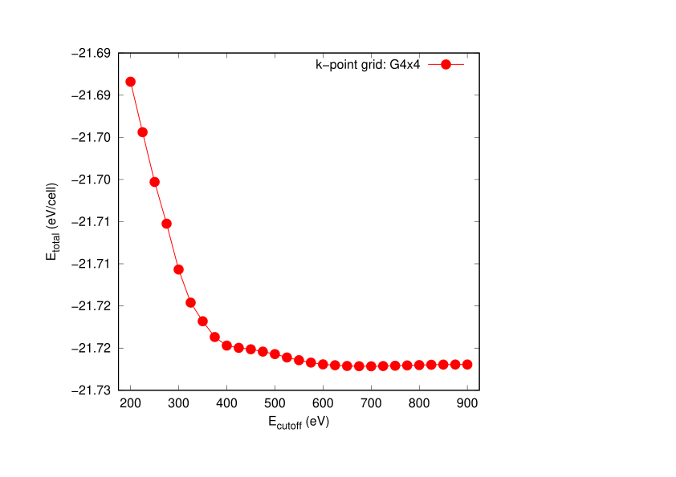
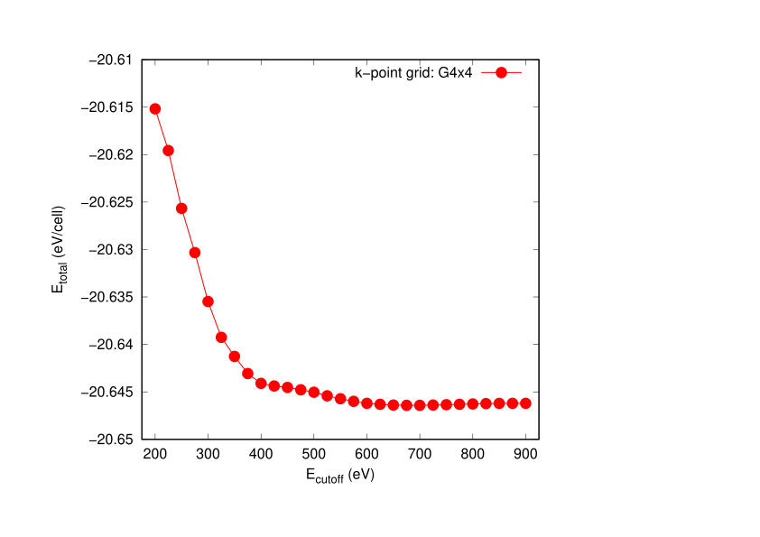
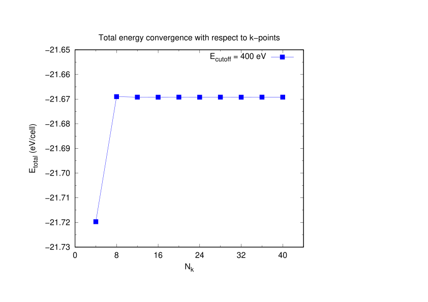
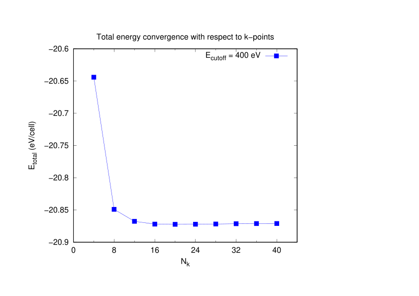

# Electronic Structure of Monolayer WSe2

## Objective
The goal of this project is to investigate the electronic band structure of monolayer WSe₂ using density functional theory (DFT), and to establish reliable computational parameters through systematic convergence tests.

## Why WSe2?
WSe₂ is a representative 2D transition metal dichalcogenide (TMD) with strong spin–orbit coupling and a direct band gap in the monolayer limit, making it a promising material for optoelectronic applications.

## Methodology
- DFT code: VASP
- Exchange–correlation functional: PBE
- Plane-wave cutoff energy (ENCUT): 400–600 eV
- k-point mesh: 6×6×1 to 15×15×1
- Vacuum thickness: 20 Å
- Convergence criteria:
  - Total energy: 1 meV/atom
  - Force: 0.01 eV/Å

## Convergence Tests

### ENCUT Convergence
We performed total energy calculations for ENCUT values ranging from 400 eV to 600 eV.  
The total energy was found to converge within 1 meV/atom at ENCUT ≥ 500 eV.

*(Figure: ENCUT vs Total Energy)*

### k-point Convergence
We tested k-point meshes from 6×6×1 to 15×15×1.  
Energy convergence within 1 meV/atom was achieved at 12×12×1.

*(Figure: k-point mesh vs Total Energy)*

## Results

### Band Structure
The calculated band structure shows a direct band gap at the K point.  
The PBE band gap is approximately 1.65 eV, consistent with previous theoretical studies.

### Density of States (DOS)
The DOS reveals dominant contributions from W d-orbitals near the conduction band minimum and Se p-orbitals near the valence band maximum.

## Discussion
- The convergence tests ensure numerical reliability of the reported electronic structure.
- The underestimation of the band gap is attributed to the known limitations of the PBE functional.
- Future work includes HSE06 calculations and spin–orbit coupling (SOC) effects.

## Directory Structure

WSe2_Monolayer/
├── README.md
├── input/
├── scripts/
├── results/
└── figures/
